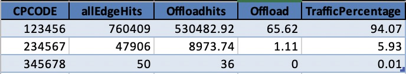

# README #

This project is to create a site-audit tool for accessing Akamai related details. 

As part of Phase 1, we are targeting only [Propert Manager (PAPI)](https://developer.akamai.com/api/luna/papi/overview.html) and per host App security summary.

### Usage ###

- In your ~/.edgerc file setup the credentials under the name __papi__ or provide the section name with '--section'.
- Ensure you have python 3.x. 
- As a pre-installation step, please add the libraries that are required.
```bash
pip install -r requirements.txt
```

To run the reports, simple issue this command:
```bash
python3 akamai-audit.py --account-key {AccountID} 
```

Depending on the number of configurations you have, this report can take at least 30 minutes to execute. Assume that it'll need about an hour - so ensure that your machine does not sleep during the time to help complete the execution of the script.


|Argument| Purpose|
|---------|--------|
| --account-key |  Account ID to Audit (only if using accountSwitch, if you have account specific credentials there is no need to add this argument) |
| --type |  as: Account Summary (default), os: Offload Summary |
| --verbose |  Print Additional details |
| --section |  EdgeRc Section  |

### Account Summary
When this program is run, it will create a folder within the current directory under the name "Account_Name". Within this folder, following files will be created:


|Sheet Name| Purpose|
|---------|--------|
| Host Summary | Provides high level summary for each hostname under all PM Configurations and their App sec protection. |
| contracts | Lists all the contracts in the account. |
| groups | Lists all the groups in the account. |
| cpcodes | Lists all the CP Codes in the account. |
| hostnames | Pulls all the host names listed within the configurations. It will also list if the domain is CNAMED to Akamai, slot and compare with the CNAME listed in the configuration. |
| certs | Lists all the enrollments in the account and their corresponding slot. |
| edgehostnames| Lists of all edge host names associated with this account |
| properties | Lists all the properties associated with the account. For each property, it will list the following details: Property name, Current version in prod and staging, latest version and first version details. Finally, it lists all the behaviors seen in the config. |
| propertyBehavior | Lists all behaviors available for each property (based on property type) and checks for their use.|
| origins | Lists all the unique origin names defined within the configurations. It will also segregate as *Customer origin* or *GTM Origin* |
| secConfigs | Lists all the WAF security configurations in the account. |
| secMatch | Lists all the WAF security configuration match targets in the account. |
| secConfigbyHost | Lists all hostnames and corresponding configurations nd match policies. |

[Example Output can be found here!](Examples)

### Offload Summary

This mode will collect offload data from the CPcodes provided in '--cpcodes' or if not provided it will do a account wide review of all CPcodes. If no dates are provided it defaults to the last month. 

The data collected provides a total summary that provide a quick view on the total offload for each CPcode, the perc (percentage) of traffic that each CPcode represents to the total hits of all CPcodes reviewed and a extension offload summary for each of the CPcodes.

|Summary| by Cpcode|
|---------|--------|
|  |   |


```bash
python3 akamai-audit.py --account-key {AccountID} --type os --start 2020-10-01 --end 2020-11-01 --cpcodes 123456 234567 345678
```

|Argument| Purpose|
|---------|--------|
| --start|  Start Date in format 'YYYY-MM-DD'. |
| --end |  End Date in format 'YYYY-MM-DD'. |
| --cpcodes |  List of cpcodes to query (space delimited). |
